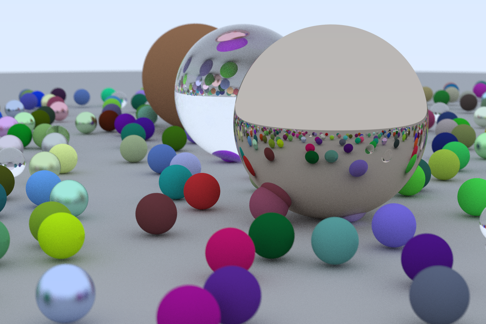

# Ray Tracing in CUDA (in One Weekend)
CUDA implementation of the [Ray Tracing In One Weekend](https://raytracing.github.io/) by Peter Shirley. 
Heavily inspired [this article](https://developer.nvidia.com/blog/accelerated-ray-tracing-cuda/) from Roger Allen.

